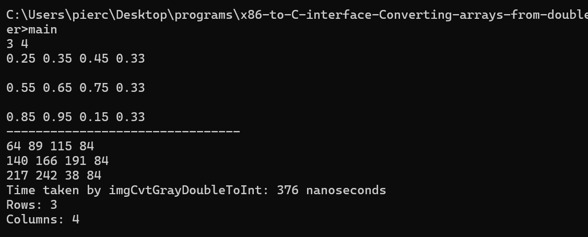

 

&#xa0;

  <!-- <a href="https://mco2_lbyarch.netlify.app">Demo</a> -->

<h1 align="center">x86-to-C interface: Converting arrays from double floating point to double unsigned integer</h1>

<!-- Status -->

<!-- <h4 align="center">
	🚧  MCO2_LBYARCH 🚀 Under construction...  🚧
</h4>

 -->

  <a href="#about">About</a> &#xa0; | &#xa0; 
  <a href="#run">How to run</a> &#xa0; | &#xa0; 
  <a href="#result" target="_blank">Performance Result</a> &#xa0; | &#xa0; 
  <a href="https://github.com/Primeputin" target="_blank">Author1</a> &#xa0; | &#xa0; 
  <a href="https://github.com/nimbus7462" target="_blank">Author2</a>

  <h2> Introduction </h2>

A grayscale image is internally represented as a 2 dimensional array. Size is defined by the number of pixels in a row (width), and number of pixels in a column (height). Each cell represents the pixel value. Pixel values in grayscale are represented as white, black, and shades of gray using different numerical data type representation depending on the library used.

Some Image Processing Libraries represent grayscale images as having double float based pixel values between 0 to 1: 0 for black, 1 for white, 0.25 lighter gray, 0.75 darker gray, and all other gray values in between.

Image =

0.25, 0.35, 0.45, 0.33

0.55, 0.65, 0.75, 0.33

0.85, 0.95, 0.15, 0.33

Some Libraries represent using 8 bit unsigned integer. 0 for black, 255 for white, 64 lighter gray, 191 darker gray, and all other gray values in between.

Image =

64, 89, 114, 84

140, 166, 191, 84

216, 242, 38, 84

To enable using different image processing libraries simultaneously, conversion from one format to the other has to be done. Perform Mapping from double precision float based grayscale to uint8 based integer representation. Each pixel is calculated using ratio and proportion equation 
 
<strong> f/i = 1/ 255 </strong> 

Where f is the double float based pixel value and i is the integer based pixel value

<h2>Task</h2>

Implement a program that converts the grayscale image representation from float based to integer based using C and x86 assembly language. Implement the function imgCvtGrayDoubleToInt().

<h3>*Required to use functional scalar SIMD registers</h3>

<h3>*Required to use functional scalar SIMD floating-point instructions</h3>

Input: height, width, double float pixel values

Example.

3 4

0.25 0.35 0.45 0.33

0.55 0.65 0.75 0.33

0.85 0.95 0.15 0.33

Output: Integer pixel values

Example.

64,  89,  114, 84

140, 166, 191, 84

216, 242, 38,  84

 

  <h2>How to run the code</h2>
  

      Make sure you're in the appropriate directory in the terminal/command prompt
  

  <code>
    nasm -f win64 function.asm
     
    gcc -c main.c -o main.obj -m64
     
    gcc main.obj function.obj -o main.exe -m64
     
  </code>

  <h2>Performance Result</h2>
  

      All Execution Time testing files can be found in the "performance_testing" branch. In order to test execution times for the varying input sizes (10x10, 100x100, 300x300), a text file was used to input the data. The main C code was also modified to run the asm function 30 times and display the average execution time for the 30 tests done.

 A library in "time.h" was used to record the execution time of the function by recording the start and end times of the function and then subtracting them before sending them to a total time variable. The variable is then divided by 30 to get the average time to execute the inputs. Note that only the function was timed and not the whole code.

<h3>Average Execution times</h3>
	<h4>	&emsp; - main < input10.txt</h4>
		
&emsp;	&emsp;	- Average execution time: 126 nanoseconds

	<h4>	&emsp;- main < input100.txt</h4>
 		
	&emsp;&emsp;	- Average execution time: 5603 nanoseconds

	<h4>	&emsp;- main < input300.txt</h4>
 		
	&emsp;&emsp;	- Average execution time: 71340 nanoseconds

<h3>Analysis</h3>
  
As expected the average execution times increase as the dataset increases. The rate at which the execution times are increasing is also noted to be exponential where the first file, input10,  appears only to take an average of 126 nanoseconds but going to 100 jumps up to an average of 5603 nanoseconds. This may indicate that more outliers in the data set happen as the range gets bigger and bigger. By comparing the rate at which the average execution time increases relative to the increase in the input we can see that input10 input took 126 nanoseconds and input100 took 5603 nanoseconds and when we move on to using input300 tasking an average of 71340 there for we can observe the increase of the average execution time is exponential as the input gets larger. This also follows the common occurrence on computers where the larger the input, the larger the execution time grows exponentially since the computer handles more data and operations which places stress on the processing unit.

	<h3>Output</h3>	

